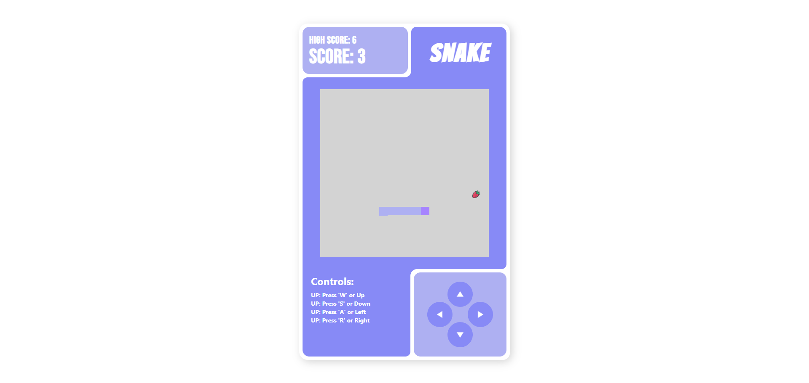

# 🐍 SnakeJS

A classic Snake game built using **HTML**, **JavaScript**, and **Tailwind CSS**, leveraging DOM manipulation for smooth gameplay. Fun, interactive, and responsive for all screen sizes!
---


## 🎮 Demo
<p align="left">
    
</p>
---


## 🛠️ Technologies Used

- **HTML** – Structure of the game
- **JavaScript** – Game logic and DOM manipulation
- **Tailwind CSS** – Styling and responsive design
---


## 🚀 Features

- Classic Snake gameplay:
  - Control the snake using **arrow keys** and **W**, **S**, **A**, **D**
  - Collect food to grow the snake
  - Avoid hitting walls or yourself
- Score tracking
- Simple, responsive design
- Smooth animations and intuitive controls
---


## ⬇️ Installation

1. Clone this repository:

```bash
git clone https://github.com/ArunRoy404/SnakeJS.git
```
---


## 🕹️ How to Play

- **Arrow Keys** – Move the snake
- **Objective** – Eat food to grow longer and increase your score
- **Game Over** – Hitting the wall or your own tail ends the game
---


## 🖌️ Customization

- Modify **Tailwind classes** in `index.html` for styling changes
- Adjust **game speed**, **board size**, or **snake behavior** in `script.js`
---


## ⚡ Future Improvements

- Add **mobile touch controls**
- Implement **levels or difficulty modes**
- Add **high score tracking** using local storage
- Add **sound effects** for actions
---


## 📝 License

**This project is open-source and free to use.**
---

